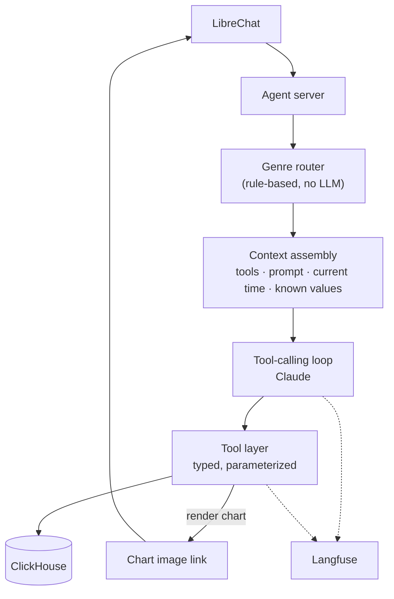
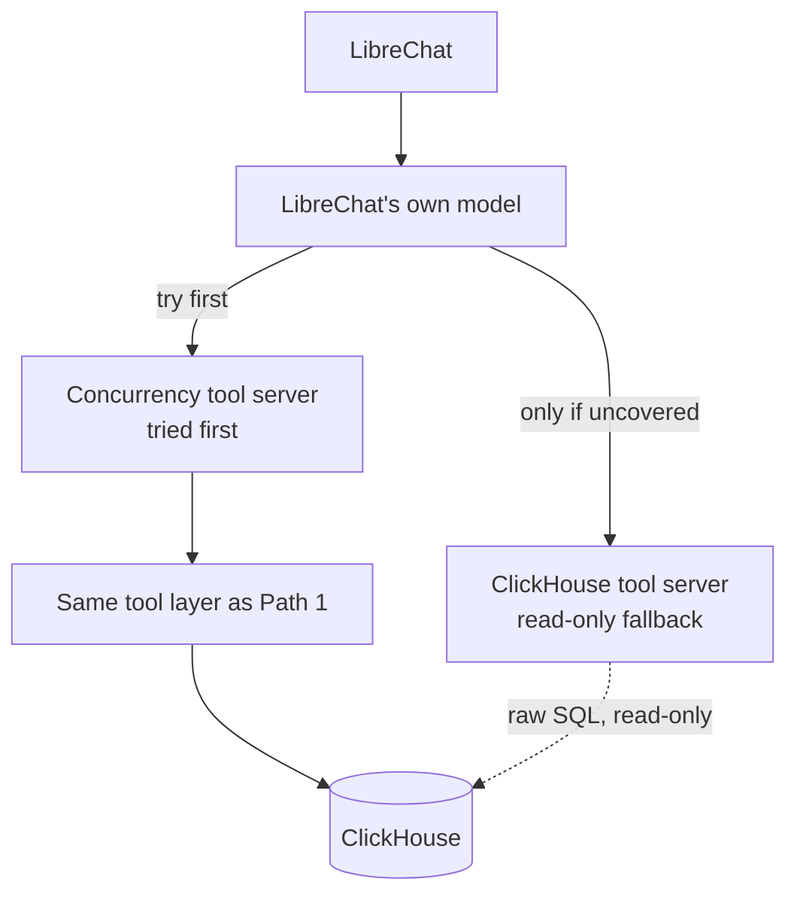

## 01 · The problem

Viewership data lives in ClickHouse as raw event and rollup tables. The goal is to let someone ask
plain-English questions in LibreChat and get a correct, plain-English answer back, sometimes with a
chart or dashboard, without turning the model into an unsupervised query author sitting in front of
a billing table. The questions in scope split into four shapes, each with its own risk level.

## 02 · Four question genres

A router classifies every question into one genre before the model sees a single tool. Each genre
gets its own restricted toolset and its own instructions, not one general-purpose toolbox.

| Genre | Example | Why it's handled this way |
|---|---|---|
| **Lookup** | "Peak concurrency on Android in the last hour?" | Simple. One filtered rollup query. |
| **Billing** | "Billable impressions for Advertiser X, 8–9pm?" | Money-sensitive — needs guardrails, not freeform SQL. |
| **Trend** | "Is concurrency on sports content rising or falling, how fast?" | Needs a rate-of-change calculation, not just a snapshot. |
| **Diagnostic** | "Why did concurrency on Content Y drop 40%?" | Needs multi-step investigation and reasoning, not a single lookup. |

## 03 · Architecture

Two paths reach the same underlying tools. **Path 1** is our own agent server: it owns the genre
router, assembles context, runs the tool-calling loop, and traces everything in Langfuse. **Path 2**
lets LibreChat's own model call tools directly, with our purpose-built tool server tried first and a
read-only ClickHouse tool server as a fallback for anything ours doesn't cover.

### 3a · Path 1 — the traced agent loop

### 3b · Path 2 — MCP, two tool servers in priority order

Both paths call the same tools and the same database. Only Path 1 is traced in Langfuse — Path 2 is
the secondary, exploration-oriented route, kept simple on purpose.

## 04 · What context the model gets

Every request builds fresh context so the model never has to guess a fact it could just be told:

- **Only the tools its genre needs** — billing questions see only the billing tool, and so on.
- **A genre-specific playbook** — e.g. diagnostic questions get a fixed investigation order: confirm the change is real, check if the content simply ended, check for technical issues, and stop at the first explanation that fits.
- **"Now," resolved against the data, not the calendar** — this is a replayed dataset, so the model is told the latest real timestamp in the data before it resolves "last hour" or "right now."
- **The real, current set of values for things like platform or content type** — queried live rather than assumed, so the model filters on values that actually exist instead of guessing a plausible-sounding one.
- **Its own tool results, fed back each turn** — so a follow-up step (like rendering a chart) works from real data it already retrieved, not something it invented.

## 05 · Guardrails

The one rule underneath everything: **the model never writes SQL.** It only ever calls typed,
parameterized tools.

- **Lookup / Trend** — read-only, no financial exposure. For trend questions, the model must report the tool's own calculated direction and speed, not eyeball a list of numbers and guess.
- **Billing** — the model can only call one pre-approved calculation, with advertiser and time range as its only inputs. There's no query for it to get wrong, because it isn't writing one. Every billing answer must include, in plain words, that the number is an estimate and not for actual invoicing.
- **Diagnostic** — a fixed investigation order keeps the model from jumping to "something's broken" before checking whether the content simply ended on schedule. Any inferred fact (like when something ended) must be presented as a likely explanation, never a confirmed one.

> Billing is the one genre where we chose a curated, pre-approved calculation over letting the model
> explore freely — the risk of a subtly wrong billing number is removed by construction, not by
> trusting the model to get it right.

## 06 · Charts & dashboards

Charts are rendered server-side and shared back as an image, not generated or guessed by the model
and not embedded as raw image data (chat UIs commonly block that for security). The model only ever
asks for a chart of data it already retrieved — it never has to reproduce that data itself.

Dashboards work two ways: a server-built version for a fixed multi-metric view, and a richer version
built live inside LibreChat as an interactive component when a question calls for a multi-metric
picture. Both follow the same visual language: one clear headline number gets real visual weight,
related metrics are grouped together, and color is only used where a number is genuinely good, bad,
rising, or falling.

## 07 · Observability

Every question run through Path 1 is traced end to end in Langfuse — the model call itself, and
every tool it invokes, each as its own step. Conversation and user identifiers travel with the trace,
so activity can be viewed per conversation or per user, not just per question.

This is where the diagnostic genre earns its keep twice over. A lookup or trend question is one tool
call — not much to trace. A diagnostic question is a real multi-step investigation, and tracing it is
what lets us actually verify the model checked things in the right order before reaching a
conclusion, rather than taking its final answer on faith.

## 08 · Design choices

- **No SQL, ever, on the primary path** — slower to extend (a new question shape needs a new tool), but removes an entire class of "plausible but wrong" query bugs, especially around billing.
- **MCP kept as a secondary path** — it's real and useful, and it's the only route with any raw-SQL access (strictly read-only), but it isn't traced or genre-restricted the way the primary path is. Treated as the exploration route, not the guarded one.
---
