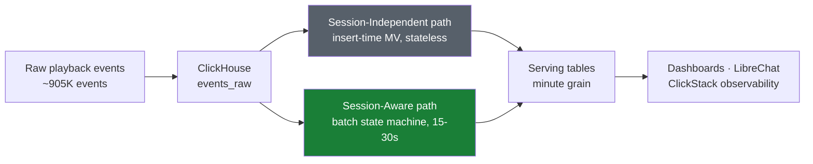
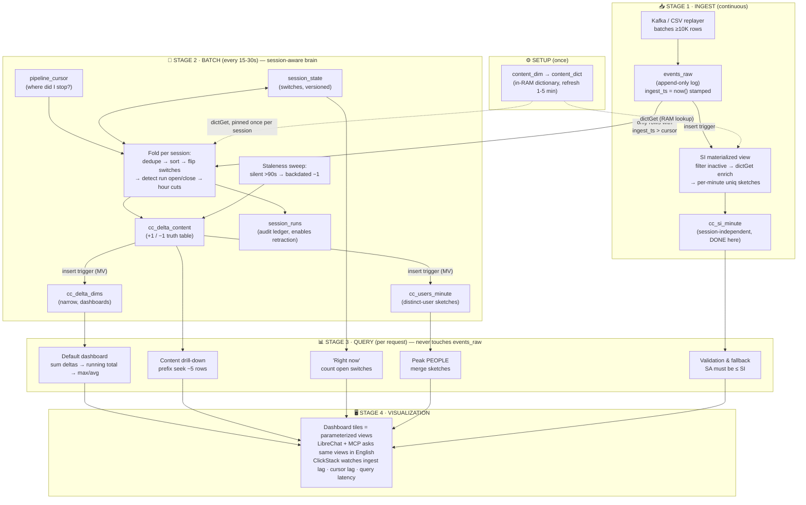
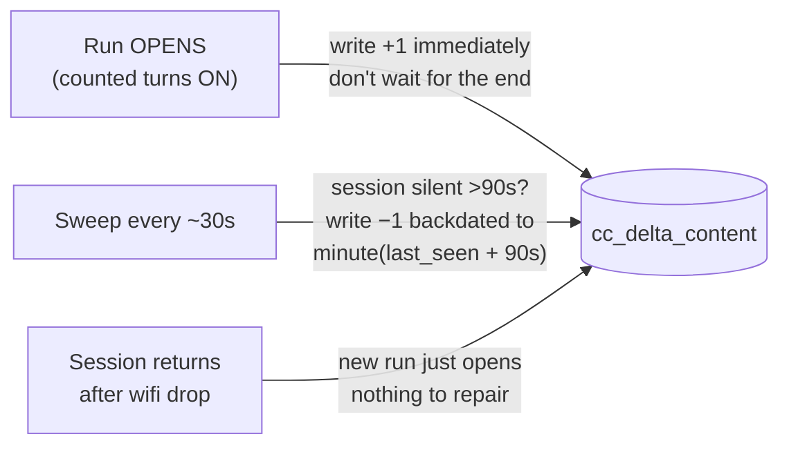
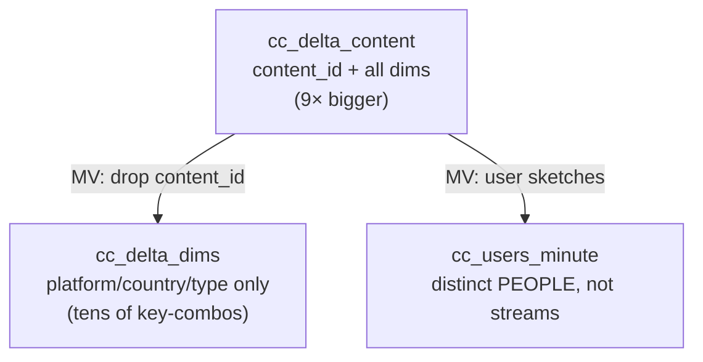

# HLD — Foreground-Only Concurrency at Streaming Scale
### SonyLIV · Click-a-thon 2026 · ClickHouse-native design

> **The question:** *"How many sessions are truly watching at minute M?"* — fast, for any
> filter (platform, country, content, video type), while data keeps arriving.
>
> **The trap:** an open session is not a watching session. Paused, backgrounded, and
> heartbeat-silent time must be excluded, or every business decision made on the
> dashboard inherits the overcount.

---

## 1. The Big Picture (30-second version)



Two independent pipelines compute concurrency from the same raw log:

| | **Session-Aware (SA)** — the main answer | **Session-Independent (SI)** — the cross-check |
|---|---|---|
| Question | Who was **truly watching**? | Who was **present** (emitted any signal)? |
| Machinery | Stateful batch job (switches + deltas) | One materialized view, zero state |
| Accuracy | Exact (excludes paused / backgrounded / stale) | ~9% high at peak (pocket heartbeats leak in) |
| Fails when | Batch job stalls | Never (fires inside the insert itself) |

The gap between the two curves **is** the phantom audience this problem exists to remove —
and SA ≤ SI per minute is a free, continuous correctness alarm.

---

## 2. Three Core Ideas

### Idea 1 — A session is just two switches and a clock

Forget the 48 event names. Per session we track only:

```
foreground switch   (AppForegrounded → ON,  AppBackgrounded → OFF)   default ON
playing switch      (VideoPlay/resume → ON, pause → OFF)             default OFF
last_seen clock     (updated by every event)
```

**COUNTED = foreground AND playing AND (now − last_seen ≤ 90s) AND not ended**

Each event flips only its own switch, so garbage sequences (pause-pause, foreground with
no prior background, heartbeats from a pocket) are harmless by construction. The tricky
case falls out for free:

```
pause → AppBackgrounded → AppForegrounded → ???
```
Coming back to the foreground does **not** un-pause you. The `playing` switch is still
OFF; counting resumes only on `resume`. The switch *is* the memory.

### Idea 2 — Store when the count CHANGES, not the count itself

Each contiguous counted stretch (a **run**) becomes exactly two rows:

```
run 10:02 → 10:17    ⇒    (10:02, +1)  and  (10:17, −1)
```

Concurrency at any minute = running sum of these deltas. A 3-hour session is still
2 rows. Heartbeats arrive every 40s but **84% of them change nothing** — that is the
entire scaling argument. No per-minute explosion, ever.

### Idea 3 — Cut every run at the top of the hour

A run crossing 11:00 is stored as `…→11:00` + `11:00→…`. The −1/+1 at the boundary
cancel, so numbers don't change — but every hour becomes **self-contained**: a query for
11:23 reads deltas from 11:00 onward, never older. Bounded reads, forever.

---

## 3. End-to-End Pipeline — Ingestion to Visualization

Everything in the system runs at exactly one of **four moments**:

| Moment | Frequency | What runs |
|---|---|---|
| **Setup** | once | Tables, materialized views, content dictionary |
| **Insert** | per event batch | Column defaults, SI materialized view |
| **Batch** | every 15–30s | The state machine (the only "brain") |
| **Query** | per request | Prefix seek + running sum / sketch merge |



**Three timing facts that make this hang together:**

1. **A materialized view is an insert trigger, not a saved query.** It sees only the newly
   inserted block, transforms it, appends to its target. Never re-reads history. That is
   why SI costs nothing and deltas fan out to the narrow table for free.
2. **A dictionary is an in-RAM hash map.** `dictGet` during insert or batch is a memory
   lookup, not a join. Queries never join metadata — enrichment already happened upstream.
3. **The batch job never rescans.** Each tick reads only the new slice of `events_raw`
   (via cursor) and only the touched sessions' switches. History is written once.

---

## 4. Live Sessions — Announce Early, Retract If Wrong

Open sessions need no special table:



Live and history are **the same table**. Rows fresher than `cursor − sweep interval` are
labelled *provisional*; older rows are *final*. No seam, no dual-path merge at query time.

---

## 5. Why the Serving Tables Are Split



- Default dashboards filter on platform/country/type — they shouldn't pay the 9× cost of
  `content_id`. They read the narrow table.
- Drill-downs put `content_id` **first** in the ORDER BY of the big table → a filtered
  query lands on ~5 rows via prefix seek.
- Distinct users can't be +1/−1'd (a phone+TV user must count once) — different math,
  different engine (uniq sketches in AggregatingMergeTree).

---

## 6. Query Semantics — Three Rules the Dashboard Must Obey

1. **Never add peaks.** Android peaks 10:56, iPhone 10:55. Sum of peaks (2,786) ≠ real
   peak (2,697). Build the minute curve for the *exact filter asked*, then take max.
2. **Peak only from minute grain.** Max of hourly averages is a different, wrong number.
3. **Say which "average".** Occupied-minutes (34.85) vs all-minutes (7.47) vs
   time-weighted (28.99) — a 4× spread on identical data. These ship as **parameterized
   views** so the dashboard and LibreChat physically cannot get the semantics wrong.

---

## 7. Hackathon Requirements Mapping

| Requirement | Where it's satisfied |
|---|---|
| ClickHouse primary datastore & engine | Everything — ingestion, state machine (SQL), serving, queries |
| Session-aware + session-independent tables | SA delta path · SI materialized view path |
| Compare both approaches | One chart, two lines; SA ≤ SI validation alert |
| Foreground-only, exclude backgrounded | The two-switch model + 90s liveness gate |
| Update-friendly (open sessions, late events) | Eager +1, sweep −1, retraction via run ledger |
| Query-efficient at scale | Delta representation + hour cuts + ORDER BY prefix seeks |
| ClickStack / LibreChat integration | ClickStack: ingest lag, cursor lag, query latency · LibreChat+MCP over parameterized views |
| The unseen day | Constants (90s timeout etc.) are config, re-measured on new data; pipeline evidence from query logs |

## 8. Scale Story (the 100× question)

- Writes to serving tables ∝ **state changes**, not events. 84% of heartbeats emit
  nothing. 10× traffic ≈ 10× sessions ≈ 10× runs — still 2 rows per run.
- Queries read **≤60 minutes of deltas** per hour queried (hour cuts), via ORDER BY
  prefix — seeks, not scans. Latency is independent of history size.
- The only stateful component reads *new events + touched sessions* per tick. No rescans,
  no rebuilds, retraction bounded to one session.
