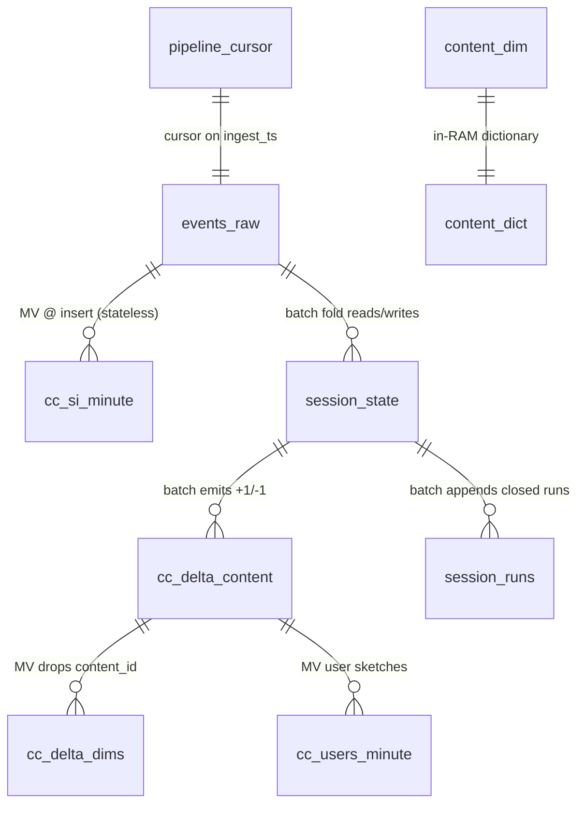
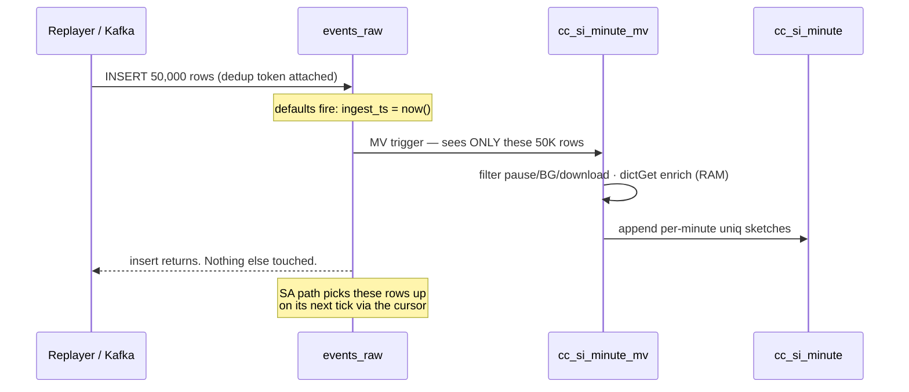
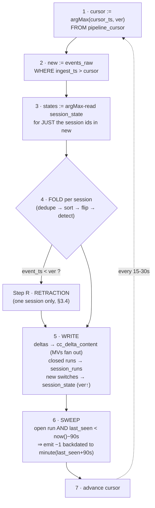
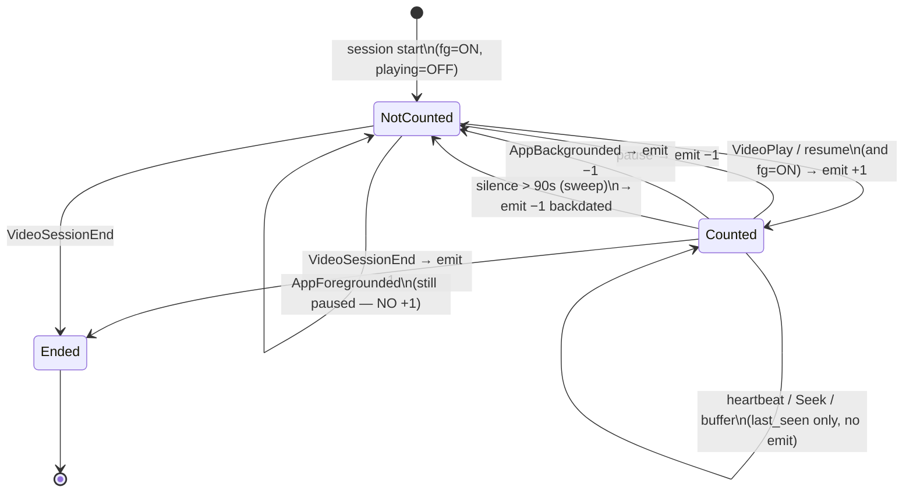
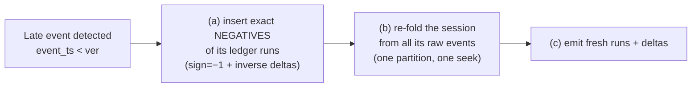

# LLD — Foreground-Only Concurrency
### Data model · State machine · Edge cases · Exact SQL

Companion to `HLD.md`. Organized by **when things run**:
Setup (once) → Insert (per batch) → Batch (every 15–30s) → Query (per request).

---

## 0. Five ClickHouse facts this design leans on

1. **A materialized view (MV) is an insert trigger, not a saved query.** It runs its
   SELECT on *newly inserted rows only* and appends the result to a target table. It
   never re-reads history and never sees later updates — which is exactly why our dedup
   cannot rely on ReplacingMergeTree and lives in the batch fold instead.
2. **A dictionary is an in-RAM hash map**, background-refreshed every LIFETIME seconds.
   `dictGetOrDefault(...)` is a memory lookup — free inside an MV or batch INSERT. This
   is how enrichment happens with **zero query-time JOINs**.
3. **SummingMergeTree collapses duplicate keys eventually, not immediately.** Never
   trust the collapse: always query `sum(x) GROUP BY key`. The engine's collapsing is
   then purely a storage optimization.
4. **ReplacingMergeTree keeps the latest version eventually, not immediately.** Read
   with `argMax(col, ver) GROUP BY key` for a handful of keys; never `FINAL` a big table.
5. **ORDER BY is the index.** Filtering on a *prefix* of the ORDER BY columns reads only
   matching granules — a seek, not a scan. This single fact decides every ORDER BY below.

---

## 1. Data Model (Setup — run once)



| Table | Engine | ORDER BY (why) | Role |
|---|---|---|---|
| `events_raw` | MergeTree | `(video_session_id, event_ts)` — batch reads whole sessions contiguously | Append-only source of truth |
| `content_dim` + `content_dict` | ReplacingMergeTree + HASHED dictionary | `content_id` | Metadata; RAM enrichment |
| `session_state` | ReplacingMergeTree(ver) | `video_session_id` — point lookups | State machine memory |
| `cc_delta_content` | SummingMergeTree | `(content_id, platform, country, video_type, category, minute)` — content drill-downs seek ~5 rows | **The truth table** of +1/−1 |
| `cc_delta_dims` | SummingMergeTree | `(platform, country, video_type, category, minute)` — platform is dominant filter | Narrow copy for dashboards |
| `cc_si_minute` | AggregatingMergeTree | `(platform, country, video_type, content_id, minute)` | SI sketches |
| `session_runs` | MergeTree | `(video_session_id, run_start)` | Audit ledger; enables retraction |
| `pipeline_cursor` | ReplacingMergeTree(ver) | `name` | One row: progress marker |

### 1.1 `events_raw` — decisions worth defending

```sql
CREATE TABLE events_raw
(
    video_session_id  String,
    user_id           String,
    content_id        UInt64,
    event_type        LowCardinality(String),
    event             LowCardinality(String),
    event_ts          DateTime64(3, 'UTC'),
    platform          LowCardinality(String),
    app_version       LowCardinality(String),
    country           LowCardinality(String),
    audio_language    LowCardinality(String),
    subtitle_language LowCardinality(String),
    player_version    LowCardinality(String),
    session_start     DateTime64(3, 'UTC'),
    ingest_ts         DateTime64(3, 'UTC') DEFAULT now64(3)
)
ENGINE = MergeTree
PARTITION BY toDate(session_start)
ORDER BY (video_session_id, event_ts);
```

- `ingest_ts DEFAULT now64(3)` — the source has no arrival time, so we stamp our own.
  The batch cursor runs on it; ClickStack's ingestion lag is `now() − max(ingest_ts)`.
- **PARTITION BY `session_start`, not event date** — every row of a session carries the
  same value, so a session's whole life lands in ONE partition even across midnight.
  Reprocessing a session never touches two partitions.

### 1.2 `session_state` — the state machine's memory

```sql
CREATE TABLE session_state
(
    video_session_id String,
    user_id          String,
    content_id       UInt64,
    platform         LowCardinality(String),
    country          LowCardinality(String),
    video_type       LowCardinality(String),
    category         LowCardinality(String),
    fg               UInt8 DEFAULT 1,     -- foreground switch (default ON)
    playing          UInt8 DEFAULT 0,     -- playing switch    (default OFF)
    last_seen        DateTime64(3, 'UTC'),
    ended            UInt8 DEFAULT 0,
    open_run_start   Nullable(DateTime('UTC')),  -- +1 written, −1 pending; NULL = no open run
    ver              UInt64                       -- max event_ts (ms) processed so far
)
ENGINE = ReplacingMergeTree(ver)
ORDER BY video_session_id
TTL toDateTime(last_seen) + INTERVAL 1 DAY;
```

- "Update" = insert a row with higher `ver`; read with `argMax(col, ver)` for **only the
  sessions in the current batch** — point lookup, not scan.
- **Dimensions are pinned at the session's first event and never changed.** Otherwise a
  mid-session platform drift (95 in the sample) emits +1 in one slice and −1 in another,
  corrupting both forever.
- `ver` doubles as the **late-event detector**: incoming `event_ts < ver` ⇒ the event
  lands inside already-emitted history ⇒ retraction path (§3.4).
- TTL = garbage collection for abandoned state only. Deliberately separate from the 90s
  activity rule — it never affects the count.

### 1.3 Delta + serving tables

```sql
CREATE TABLE cc_delta_content
(
    minute         DateTime('UTC'),
    content_id     UInt64,
    platform       LowCardinality(String),
    country        LowCardinality(String),
    video_type     LowCardinality(String),
    category       LowCardinality(String),
    delta_sessions Int64
)
ENGINE = SummingMergeTree(delta_sessions)
PARTITION BY toDate(minute)
ORDER BY (content_id, platform, country, video_type, category, minute);
```

SummingMergeTree because everything the pipeline does is **pure addition**: retro-dated
−1s, hour-cut −1/+1 pairs, retraction negatives — all just add. Fan-out is automatic:

```sql
CREATE MATERIALIZED VIEW cc_delta_dims_mv TO cc_delta_dims AS
SELECT minute, platform, country, video_type, category, delta_sessions
FROM cc_delta_content;   -- fires at Stage-2 insert; SummingMergeTree collapses the dupes
```

### 1.4 Session-independent MV (Stage-1, stateless)

```sql
CREATE MATERIALIZED VIEW cc_si_minute_mv TO cc_si_minute AS
SELECT
    toStartOfMinute(event_ts) AS minute,
    content_id, platform, country,
    dictGetOrDefault(content_dict, 'video_type', content_id, 'unknown') AS video_type,
    uniqCombinedState(14)(video_session_id) AS sessions_state,
    uniqCombinedState(14)(user_id)          AS users_state
FROM events_raw
WHERE NOT (event = 'pause' OR event LIKE 'download%'
        OR event_type IN ('AppBackgrounded', 'VideoSessionEnd'))
GROUP BY minute, content_id, platform, country, video_type;
```

- Definition: *a session counts in minute M if it emitted any non-inactive event in M.*
  No memory of previous minutes — that's what "session-independent" means.
- **Sketches, not counts**: a session emits ~1.5 events/min, so we must dedupe within
  the minute, and sketches from separate insert blocks merge correctly later
  (AggregatingMergeTree merges states; `uniqCombinedMerge` finishes at query time).
- `dictGetOrDefault` (not a JOIN): 1,089 content rows have blank metadata — a JOIN would
  silently drop those sessions from every video_type answer; the dictionary maps them
  to `'unknown'` instead.
- **Known bias: ~9% high at peak** (heartbeats fire from pockets and during pause).
  Not a bug — the stateless ceiling. Used as validation (SA ≤ SI), fallback, and demo.

---

## 2. Insert Time — what happens when 50K events land



Insert hygiene at scale: batches ≥10K rows (or `async_insert=1`); every batch carries an
`insert_deduplication_token` so a retried insert cannot create duplicate raw rows.

---

## 3. Batch Time — the state machine (every 15–30s)

The only component with logic. A thin scheduler runs these steps as ClickHouse SQL:



### 3.1 The fold, concretely (step 4)

Per session, in one SQL statement (`groupArray` → `arraySort` → walk):

1. **Dedupe** — drop exact repeats of `(event_type, event, event_ts)`. 4,210 duplicates
   exist in the sample; ONE duplicated boundary event would skew deltas forever.
2. **Sort** by `(event_ts, tie_priority)` with fixed priority
   `START, PLAY, FG, RESUME, HB, ERR, PAUSE, BG, END`. Never trust arrival order (11.3%
   of steps arrive out of order); never leave same-millisecond ties (161K!) to chance.
3. **Flip switches** — each event touches exactly ONE thing:

   | Event | Effect |
   |---|---|
   | `VideoPlay`, heartbeat `resume` | `playing = 1` |
   | heartbeat `pause` | `playing = 0` |
   | `AppForegrounded` | `fg = 1` |
   | `AppBackgrounded` | `fg = 0` |
   | `VideoSessionEnd` | `ended = 1` |
   | heartbeat `download_*` | ignored completely |
   | `VideoError`, `buffer-health`, `Seek`, everything else | `last_seen` only |

   Every event also bumps `last_seen`.
   **counted = fg AND playing AND NOT ended AND not-stale.**
   Note `AppForegrounded` does **not** set `playing` — back on screen while paused
   stays uncounted until `resume`.

4. **Emit on change only:**
   - counted turns **ON** → `(+1, this minute)` **immediately** (eager — open sessions
     count at the live edge); remember `open_run_start`.
   - counted turns **OFF** → `(−1, first minute after last counted one)`; append run to
     `session_runs`; clear `open_run_start`.
   - still counted across an **hour boundary** → emit −1 and +1 both at the boundary
     (net zero; keeps every hour self-contained).

### 3.2 The per-session state machine



### 3.3 Worked example — 16-minute session, 4 delta rows

```
event                          fg  playing  counted   emitted
10:02:01 VideoSessionStart      1     0       no
10:02:03 VideoPlay              1     1       YES      +1 @ 10:02
10:05:30 hb pause               1     0       no       −1 @ 10:06   (run 10:02→10:06 → ledger)
10:06:10 AppBackgrounded        0     0       no
10:09:00 AppForegrounded        1     0       no                    ← back, still paused!
10:09:05 hb resume              1     1       YES      +1 @ 10:09
10:17:45 VideoSessionEnd        1    1→end    no       −1 @ 10:18   (run 10:09→10:18 → ledger)
```

The ~20 heartbeats at 40s intervals between these events emitted **nothing** — 84% of
all heartbeats change no serving row. That is the whole scaling story.

### 3.4 Step R — retraction (late event inside emitted history)

Triggered when `event_ts < ver` in the fold. For **that one session only**:



Addition undoes addition — nothing is rewritten, and cost is bounded to one session.

**Idempotency:** re-running any batch is harmless — dedupe + the `ver` check mean
already-processed events emit nothing new.

---

## 4. Query Time — what a dashboard request actually does

Dashboards **never read `events_raw`**. Every question becomes: *seek a short range of
delta rows, add them up in order.*

### 4.1 The curve (the building block)

```sql
SELECT minute,
       sum(d) OVER (ORDER BY minute) AS concurrency
FROM (
    SELECT minute, sum(delta_sessions) AS d      -- collapse unmerged parts (fact #3)
    FROM cc_delta_dims
    WHERE platform = 'ANDROID_PHONE'
      AND minute >= toStartOfHour(toDateTime('2026-07-26 10:30:00'))
      AND minute <  toDateTime('2026-07-26 11:30:00')
    GROUP BY minute
)
ORDER BY minute;
```

It starts at `toStartOfHour(from)` because hour cuts guarantee every session active at
the hour top re-emitted +1 there — the running sum starting from zero is exact, and
nothing older is ever read.

Mini example — deltas `(10:02,+1)(10:06,−1)(10:09,+1)(10:18,−1)` + a second session
`(10:03,+1)(10:12,−1)`:

```
minute   10:02  10:03  10:06  10:09  10:12  10:18
delta     +1     +1     −1     +1     −1     −1
running    1      2      1      2      1      0
```

Between listed minutes the value **holds** — concurrency is a step function. We never
generate the empty minutes; max and time-weighted avg don't need them:

### 4.2 Peak and average

```sql
WITH stepped AS (
    SELECT minute,
           sum(d) OVER (ORDER BY minute) AS cc,
           leadInFrame(minute, 1, toDateTime('2026-07-26 11:30:00'))
             OVER (ORDER BY minute ROWS BETWEEN CURRENT ROW AND 1 FOLLOWING) AS nxt
    FROM ( /* same inner query as 4.1 */ )
)
SELECT
    max(cc) AS peak,                                   -- exact: curve is flat between rows
    sum(cc * dateDiff('minute', greatest(minute, {from}), nxt))
      / sum(dateDiff('minute', greatest(minute, {from}), nxt)) AS avg_time_weighted
FROM stepped
WHERE nxt > {from};
```

Hour/day grain = `GROUP BY toStartOfHour(minute)` over `stepped`, take `max(cc)` per
bucket. **Never** average first and max later. **Never** sum two slices' peaks. These
ship as parameterized views so dashboards and LibreChat can't get semantics wrong.

### 4.3 The other three reads

```sql
-- "Right now" (zero lag): count the open switches directly
SELECT count() FROM (
    SELECT argMax(fg,ver) fg, argMax(playing,ver) playing,
           argMax(ended,ver) ended, argMax(last_seen,ver) last_seen
    FROM session_state GROUP BY video_session_id )
WHERE fg=1 AND playing=1 AND ended=0
  AND last_seen > now64(3) - INTERVAL 90 SECOND;

-- Peak PEOPLE (not streams): finish sketches per minute, then max
SELECT max(u) FROM (
    SELECT minute, uniqCombinedMerge(users_state) AS u
    FROM cc_users_minute
    WHERE platform = {p} AND minute >= {from} AND minute < {to}
    GROUP BY minute );

-- Validation: SA must never exceed SI (alert if SA > SI * 1.02)
SELECT minute, uniqCombinedMerge(sessions_state) AS si
FROM cc_si_minute
WHERE minute >= {from} AND minute < {to}
GROUP BY minute;
```

Freshness labelling: rows with `minute > cursor − sweep interval` are `provisional`;
older rows final. Same table, no seam.

---

## 5. Edge Cases — the full ledger

| # | Edge case (real in the data) | Handling |
|---|---|---|
| 1 | **Duplicate events** (4,210 exact dupes) | Dedupe on `(event_type, event, event_ts)` in the fold, *before* emitting — one duplicated boundary event would poison deltas forever. Retried inserts blocked by `insert_deduplication_token`. |
| 2 | **Out-of-order arrival** (11.3% of steps) | Always sort by `event_ts` inside the fold; never trust arrival order. |
| 3 | **Same-millisecond ties** (161K) | Fixed tie priority `START,PLAY,FG,RESUME,HB,ERR,PAUSE,BG,END` — deterministic, reproducible. |
| 4 | **Late event inside emitted history** | `event_ts < ver` triggers retraction: negate ledger runs, re-fold one session, re-emit. Bounded cost. |
| 5 | **pause → background → foreground** | Foreground does not set `playing`; stays uncounted until `resume`. The switch is the memory. |
| 6 | **Heartbeats from a pocket** (3,674 while backgrounded) | HB only updates `last_seen`; it never opens the `fg` switch. |
| 7 | **Garbage sequences** (pause-pause, FG w/o BG, events after END) | Flipping a switch to where it already is emits nothing. Harmless by construction. |
| 8 | **Open sessions at the live edge** | Eager +1 at run open; sweep writes backdated −1 at silence+90s. No rebuild. |
| 9 | **Wifi drop, then return** | Count stops at silence+90s (correct — not watching); return opens a new run. Nothing to repair. |
| 10 | **43-hour zombie sessions / missing END markers** | The 90s liveness gate closes them automatically; state row GC'd by TTL after 1 day. |
| 11 | **Session crossing midnight** | Partitioned by `session_start` — whole session in one partition; reprocessing never spans two. |
| 12 | **Session crossing an hour boundary** | −1/+1 pair at the boundary (net zero) — every hour self-contained, queries read ≤60 min of history. |
| 13 | **Mid-session dimension drift** (95 platform drifts) | Dims pinned at first event, never changed — else +1 lands in one slice and −1 in another, corrupting both. |
| 14 | **Blank content metadata** (1,089 rows) | `dictGetOrDefault → 'unknown'` — a JOIN would silently drop those sessions. |
| 15 | **Pause/resume twice within one minute** | Merge a session's counted-minutes into runs *before* emitting — one viewer, not two. (Unfixed this inflates peak 7.6%.) |
| 16 | **Multi-device user** (phone + TV) | Streams: two sessions, count 2. People: uniq sketch on `user_id`, count 1. Separate table, separate math. |
| 17 | **Batch pipeline stalls** | SI keeps updating (fires inside insert). Dashboards show a band: "between SA (true) and SI (present)". ClickStack alerts on cursor lag. |
| 18 | **Batch re-run / crash mid-run** | Idempotent: dedupe + `ver` check ⇒ already-processed events emit nothing new. |
| 19 | **Too many parts under load** | Batches ≥10K rows or `async_insert=1`. |
| 20 | **SA bug (silent wrongness)** | Continuous invariant: SA ≤ SI per minute per slice, alert at SA > SI·1.02. |

---

## 6. Constants

| Constant | Value | Why |
|---|---|---|
| Liveness timeout | **90s** | ~2 missed 40s heartbeats (measured; docs' "60s" is wrong). Config — re-measure on the unseen day. |
| Batch interval | 15–30s | Live-edge freshness vs insert-parts pressure |
| Insert batch size | ≥10K rows | Avoid "too many parts" |
| State eviction TTL | 1 day | Memory GC only; never affects the count |
| Run cut | hour boundary | Every hour self-contained; any run ≤60 min |
| Serving grain | 1 minute | Peak can't be rebuilt from coarser grains |
| Foreground default | ON | 97% of first BG markers arrive after first PLAY |
| Playing default | OFF | Pre-`VideoPlay` = startup, not watching |
| Tie-break priority | START,PLAY,FG,RESUME,HB,ERR,PAUSE,BG,END | Reproducibility across 161K same-ms ties |
